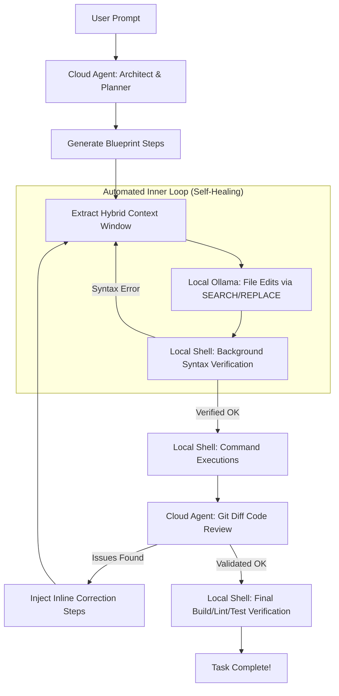

# 👷 Foreman: Cloud Architect + Ollama Coder Orchestrator

Foreman is a local-first, interactive Terminal User Interface (TUI) orchestrator that bridges **Cloud Architect Agents** (like Google Antigravity CLI, Anthropic's Claude Code, or GitHub Copilot) with **local Ollama models** (low-level code generation and execution). 

By splitting the workload—using a high-reasoning cloud model as the **Architect (Planner)** and a fast, free local model as the **Builder (Coder)**—Foreman cuts API costs by over 90% while guaranteeing code quality through automated verification loops.

---

## 💡 The Core Philosophy: Split & Save

1. **The Planner (Cloud)**: A cloud agent (AGY, Claude Code, or GitHub Copilot) inspects the workspace, reasons about the goal, and produces a highly detailed step-by-step implementation blueprint.
2. **The Builder (Local)**: A local Ollama model (like `qwen2.5-coder:7b` or `qwen2.5-coder:1.5b`) takes the instructions, performs the actual file edits, and executes terminal commands step-by-step.
3. **The Validator (Cloud)**: Before finishing, a `git diff` of the changes is reviewed by the selected cloud agent to ensure absolute precision, catching bugs, typos, and syntax errors inline.



---

## 🚀 Key Features

*   **Multi-Cloud Agent Support**: Select your high-level architect:
    *   **AGY (Google Antigravity CLI)**
    *   **Claude Code (Anthropic CLI)**
    *   **GitHub Copilot (GitHub CLI)**
*   **Premium Interactive TUI**: Built with Go and Charm's Bubble Tea/Lipgloss frameworks. Features real-time log streaming, scrollable blueprints with auto-wrapping, Dracula-themed status bars, and fixed terminal layout constraints.
*   **Production-Grade Architecture for Small Models**:
    *   **Hybrid Context Window**: To prevent "context blindness" in 7B models, Foreman automatically extracts the top 30 lines (imports/interfaces) and stitches them with a focused 40-line window around the target block. This provides high-signal context without thousands of lines of noise.
    *   **Strict Step Separation**: The Cloud Architect is explicitly instructed to never combine distant file edits into a single step, guaranteeing that the local model only processes bite-sized, isolated modifications.
    *   **Aider-Style Block Replacement**: Instead of outputting the entire file, Foreman forces the model to use strict `<<<<` `====` `>>>>` SEARCH/REPLACE blocks.
    *   **Automated Inner Loop (Self-Healing)**: Foreman extracts project verification commands (e.g., `go build`, `npm run lint`) and runs them automatically in the background after every file edit. If a small model makes a syntax error, Foreman captures the compiler output and automatically feeds it back to the local model to self-correct (up to 3 retries) without requiring user intervention.
*   **Inline Cloud Code Review**: A built-in code reviewer step runs `git diff` on the workspace and asks the cloud agent to review the changes. If it spots bugs, it dynamically injects correction tasks *directly into the active execution steps list* for the local model to run.
*   **Automated Build, Lint & Test**: Automatically detects the type of project you are working on (Go, Node.js, Rust, Python, etc.) and runs the corresponding compile, lint, and test suites as the final verification step.
*   **Multi-Task Session Continuation**: When a task completes, you can choose to continue in the same session. This passes the `--continue` flag to the cloud runner, preserving context history, file modifications, and decisions for the next task.

---

## 🛠️ Prerequisites

1. **Go** (v1.20 or higher)
2. At least one of the following Cloud Agent CLIs:
   - **Antigravity CLI** (`agy`) installed and configured.
   - **Claude Code** (`claude`) globally installed, or `npx` available to run it on-demand.
   - **GitHub Copilot CLI** extension (`gh copilot`) configured through GitHub CLI (`gh`).
3. **Ollama** running locally on `http://localhost:11434` with at least one coder model downloaded:
   ```bash
   # Highly recommended local coding model:
   ollama run qwen2.5-coder:7b
   ```

---

## 📦 Building & Running

1. Clone the repository:
   ```bash
   git clone https://github.com/henrikandersson/foreman.git
   cd foreman
   ```
2. Build the binary:
   ```bash
   go build -o foreman
   ```
3. Run it from anywhere:
   ```bash
   ./foreman
   ```

---

## 🎮 How to Use

1. **Select Project Folder**: Type or paste the path to your target project folder (or press **Enter** to default to the current directory).
2. **Select Cloud Agent**: Use the **Up/Down** arrows to select the Cloud Architect CLI (AGY, Claude Code, or Copilot).
3. **Select Local Model**: Use the **Up/Down** arrows to select the local Ollama model to use.
4. **Describe Task**: Write what you want to implement (e.g., `"Add a JWT authentication middleware to the express server"`) and press **Enter**.
5. **Review Blueprint**: Use **Up/Down/PageUp/PageDown** to scroll the generated plan.
    *   *Need changes?* Type refinement feedback at the bottom and press **Enter** to let the cloud agent update the plan.
    *   *Looks good?* Press **Ctrl+E** to approve the blueprint and proceed to execution.
6. **Execution**:
    *   Press **Enter** to execute steps sequentially.
    *   Press **Ctrl+A** to auto-run all steps.
    *   If a build check or test fails, type instructions to correct the code, or skip the step using **Ctrl+S**.
7. **Session Loop**: Once the task is completed, press **Enter** to choose whether to **Continue the current session** (preserving context) or **Start a new session** for your next request.

---

## 📄 License

This project is licensed under the MIT License - see the LICENSE file for details.
